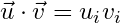

# atlas-dot

Calculates the inner product between two sets of data points.

[](https://travis-ci.org/atlassubbed/atlas-dot)

---

## install

```
npm install --save atlas-dot
```

## why

Breaking up [atlas-dataset](https://github.com/atlassubbed/atlas-dataset#readme) into standalone functions. This module contains the dot product:

<p align="center">
  
</p>

## examples

#### <i>v</i> &middot; <i>v</i>

```javascript
const dot = require("atlas-dot")
console.log(dot([1,2]))
// 5 
```

#### <i>u</i> &middot; <i>v</i>

```javascript
...
console.log(dot([1,2], [3,4]))
// 11
```

## caveats

Input checking is the responsibility of the caller. Make sure your arrays contain numbers and are of the same length.